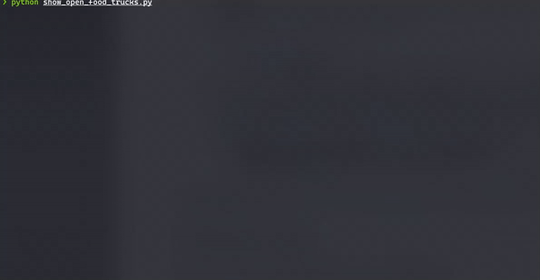

# Foodiezz App
A simple command line app to list all the Food Trucks that are open at current time in San Francisco.

## Setting Up the Environment
_Requires Python3.6 or higher installed in the system_

1. Install python3 virtualenv `pip3 install virtualenv`. You can jump to Step 2 if `virtualenv` is already installed.
    * On macOS and Linux this command can also be used `python3 -m pip install --user virtualenv`
    * On Windows use this command if the above command does not work `py -m pip install --user virtualenv`
    * On Debian/Ubuntu systems you may have to install python3-venv using `apt-get install python3-venv`
    * More information can be found here: [Installing virtualenv](https://packaging.python.org/guides/installing-using-pip-and-virtual-environments/#installing-virtualenv)
2. Create a python virtual environment for the project by running the following command in project root
    * `python3 -m venv venv`
    * Running this command from project root will create a folder called `venv`
3. Activate the virtual environment in the terminal `source venv/bin/activate`
    * On Windows use this command `.\venv\Scripts\activate`
    * You can check if the environment is activated by checking the terminal prompt which should now have `(venv)` in front of the prompt or by running the following command `which python`
    * `which python` should print the full path of the python interpretor that is being used by the shell
4. Install project dependencies `pip install -r requirements.txt`

**All the above commands need to run from project's root directory**

## Running the App
_Make sure the virtual environment is activated in the terminal - `source venv/bin/activate`_
```shell script
python show_open_food_trucks.py
```
or 
```shell script
venv/bin/python show_open_food_trucks.py
```


- By default, the app will print only 10 results in the console. If you would like to view more, you can press enter.
- You can also change the number of results that can be displayed at once by editing the **PAGE_LIMIT** env variable in the environment file `env/config.env`

## Dependencies
* [sodapy](https://github.com/xmunoz/sodapy) - Socrata Open Data API Python client
* [pydantic](https://github.com/samuelcolvin/pydantic/) - For creating static data models in python
* [python-dotenv](https://github.com/theskumar/python-dotenv) - For reading `.env` files
* [prettytable](https://github.com/jazzband/prettytable) - For printing data on the console in tabular format
* [halo](https://github.com/manrajgrover/halo) - For displaying spinner in console


## Future Improvements
Currently, I am fetching the complete dataset all at once from the SODA API. The reason I am doing this is because some food truck have multiple entries for the same location in the dataset because of multiple timings.
Once I have the complete dataset, I am using a hash map to remove duplicates from the data and then paginating the results for the output. What I would like to improve here is, if possible, to get the unique data from the SODA API
using SoQL query and use the pagination feature provided by SoQL. This is helpful when the dataset gets huge and current approach can crash the process. Also, it is helpful while scaling the app.  